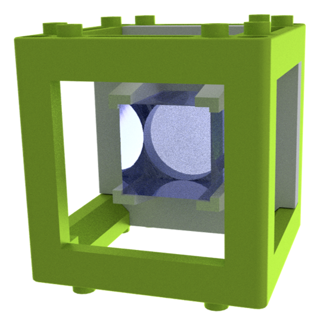
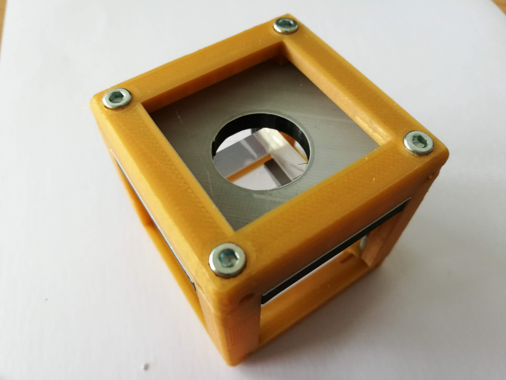
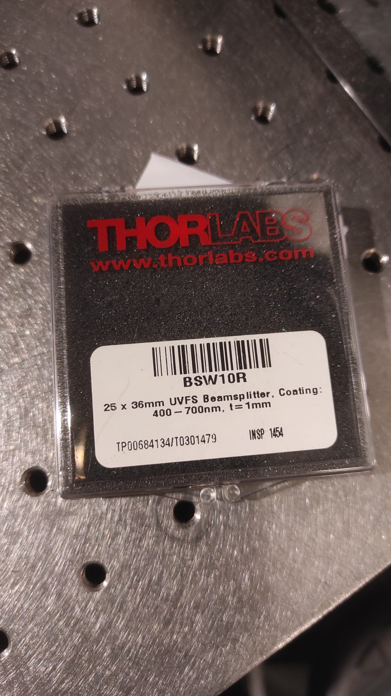

# Beam Splitter Module

Below we describe how the Beam Splitter Module in UC2 system can be build and assembled in order to replicate the whole system as shown in the rendering above.

More details about the 3D-printing, assembling and setting up can be found in [UC2-GIT](https://github.com/openUC2/UC2-GIT/tree/master/CAD/ASSEMBLY_CUBE_Beamsplitter) repository in detail.

## Ready-to-use Beam Splitter Module

## Beam Splitter Component in Thorlabs system

Thorlabs Beamsplitter is used in the setup.
* Non-Polarizing
* 50:50
* Size : 25 x 36 mm
* Product Catalog Code: BSW10R
* Coating: 400 - 700 nm

More details can be found [here](https://www.thorlabs.com/thorproduct.cfm?partnumber=BSW10R).

