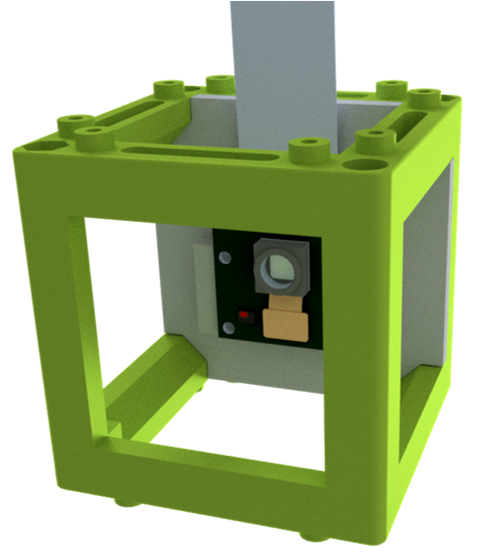

# Camera Module

In this part, we descbribe how the Raspberry Camera is connected to the system and used. Details about connection of the camera and setting up the Rapsberry Pi 4 can be found in UC2-GIT [RasPi Camera Module](https://github.com/openUC2/UC2-GIT/tree/master/CAD/ASSEMBLY_CUBE_RaspiCam) and [Setting up Raspberry Pi.](https://github.com/openUC2/UC2-Software-GIT/blob/master/GUI/RASPBERRY_PI/README.md)

We are using Raspberry Pi Camera Module v2 from [Okdo.](https://www.okdo.com/p/official-raspberry-pi-camera-v2-1/)

* It attaches via a 15cm ribbon cable to the CSI port on the Raspberry Pi.
* The camera works with all models of Raspberry Pi 1, 2, 3 and 4.

Installation Guide of the RasPi camera can be found [here.](https://www.raspberrypi.com/documentation/accessories/camera.html) in details.

| Hardware Specifications | Camera Module v2 |
| --- | --- |
| **Net price** | $25 |
| **Weight** | 3g |
| **Still resolution** | 8 Megapixels |
| **Video modes** | 1080p30, 720p60 and 640 × 480p60/90 |
| **Sensor** | Sony IMX219 (high-speed video imaging and high sensitivity)|
| **Sensor resolution** | 3280 × 2464 pixels |
| **Sensor image area** | 3.68 x 2.76 mm (4.6 mm diagonal) |
| **Pixel size** | 1.12 µm x 1.12 µm |
| **Optical size** | 1/4" |
| **Focal length** | 3.04 mm |
| **Horizontal field of view** | 62.2 degrees |
| **Vertical field of view** | 48.8 degrees |
| **Focal ratio (F-Stop)** | 2.0 |

| Software Features | Camera Module v2 |
| --- | --- |
| **** |  |
| **** |  |
| **** |  |
| **** |  |
| **** |  |

Camera *raspistill* codes are listed [here.](https://www.raspberrypi.com/documentation/accessories/camera.html#raspistill)

## Basic RasPi Camera Codes for Terminal
There are various ways the cameras can be used. The simplest option is to use one of the provided camera applications, such as libcamera-still or raspistill.

* Activating RasPi Camera:  
      raspistill -k
* Activating RasPi Camera for a time:

* Taking Picture:
      raspistill -o ~/Pictures/first_image.jpg

*-o* is the option to specify an output file name. Here o is the abbreviation for output.   
*~/Pictures/first_image.jpg* is the path + file name for saving the picture. “~” means that we’ll start from the home directory (from the user you’re connected as), then we have *“/Pictures/”* to go in the Pictures directory of that user, and finally *“first_image.jpg”* is the file name.     
I have used a “.jpg” extension here, you can also use other common image extensions such as “.png”. Don’t forget the extension otherwise you might have trouble opening the file if you share it for example on a Google Drive or on Windows.

You can also provide a relative path to save the picture from where you are in the terminal.   

      $ cd ~/Pictures/
      $ raspistill -o second_image.jpg

* Editing Photo settings with commands:  
Let’s try one command to change the resolution, flip the image vertically, and wait 2 seconds instead of 5.

      $ raspistill -o ~/Pictures/new_image.jpg -w 1280 -h 720 -vf -t 2000

Let’s break this command down:
  * raspistill: the command to take a picture.
  * -o ~/Pictures/new_image.jpg: the option to add an output file name, as previously seen.
  * -w 1280 -h 720: to set the resolution you have to provide 2 options. –w for the width in pixels, and –h for the height in pixels.
  * -vf: this option will vertically flip the picture.
  * -t 2000: this is the timeout option. Basically, once you execute the raspistill command in the terminal, it will wait for x amount of milliseconds before taking the picture and exiting. By default the amount is 5 seconds, or 5000 milliseconds. Here we choose 2000, which means 2000ms or 2 seconds. Make sure to always provide a duration in milliseconds for that option.

* Applying filters to Pi camera
  * -co -10: this will reduce the contrast a little bit. The contrast setting goes from -100 to 100, default to 0 (no change).
  * -br 55: increase the brightness a little bit. The brightness setting goes from 0 and 100, default to 50.
  * -sa -10: decrease the saturation. The saturation setting goes from -100 to 100, default to 0.

* Adding text to the photo
If you want to add some text on your photo, you can do so with the -a option. For example:

      -a "Hello from the Pi camera"

More details can be found [here.](https://roboticsbackend.com/raspberry-pi-camera-take-picture/)

## Ready-to-use Camera Module

## Collaborating
If you find this project useful, please like this repository, follow us on Twitter and cite the webpage! :-)
