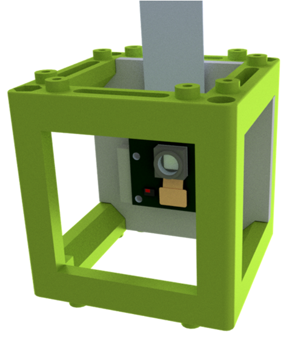
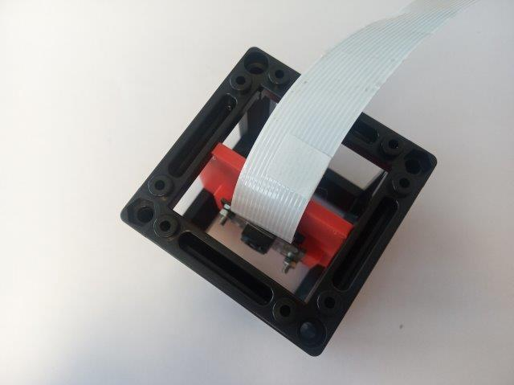

# Camera Module

In this part, we descbribe how the Raspberry Camera is connected to the system and used. Details about connection of the camera and setting up the Rapsberry Pi 4 can be found in UC2-GIT [RasPi Camera Module](https://github.com/openUC2/UC2-GIT/tree/master/CAD/ASSEMBLY_CUBE_RaspiCam) and [Setting up Raspberry Pi.](https://github.com/openUC2/UC2-Software-GIT/blob/master/GUI/RASPBERRY_PI/README.md)

## Basic RasPi Camera Codes for Terminal
* Activating RasPi Camera:  
      raspistill -k
* Activating RasPi Camera for a time:

* Taking Picture:

* Recording Video:

## Ready-to-use Camera Module

## Collaborating
If you find this project useful, please like this repository, follow us on Twitter and cite the webpage! :-)
