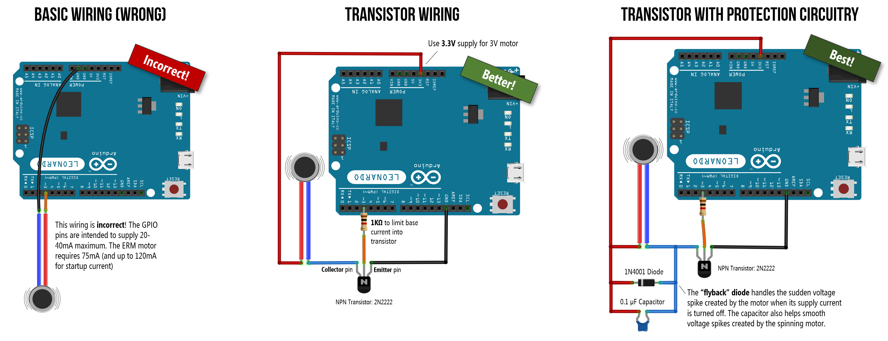
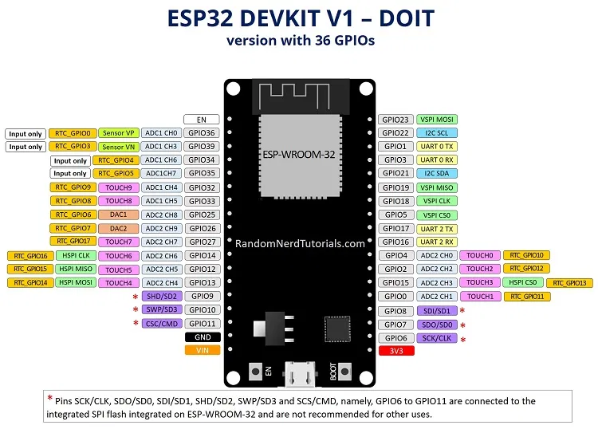
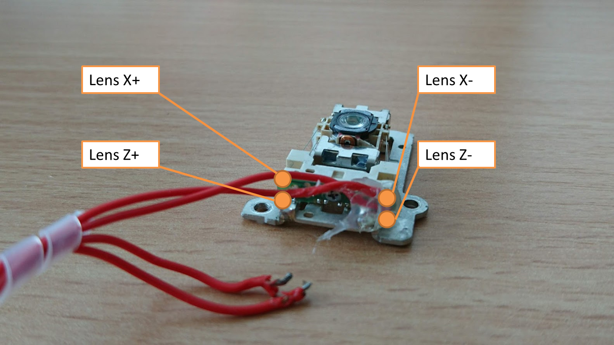

# VOICE COIL ACTUATOR

Voice Coil Actuator is used in the UC2-OCT system to move the sample or sample mirror in z direction in um scale.
It can be used for the alignment of the reference mirror with using 3 voice coil actuators in three corners of the mirror holder to obtain fine alignment in low coherence light source setups.

## PWM (Pulse Width Modulation)

PWM is a

## ESP-32S
ESP-32S is a

Follow [this page](https://github.com/openUC2/UC2-Software-GIT/tree/master/HARDWARE_CONTROL/ESP32) for ESP-32 seeting up using Arduino IDE.
Prepare your IDE to work with the ESP32 boards, as awesomely described [here.](https://randomnerdtutorials.com/installing-the-esp32-board-in-arduino-ide-windows-instructions/)

### Components of the System

|  Type | Details  |  Amount | Price | Link  |
|---|---|---|---|---|
| Voice Coil Actuator | ** |  4  |  x,xx € | [Design File](./INVENTOR)  | [Part.stl](./STL/)  |
| Star LED Cage Holder Top |  *It covers top of the cage design* |  1  |  x,xx € | [Design File](./INVENTOR)  | [Part.stl](./STL/) |

### Connection of VCA with Microcontroller

*Connection Diagram of the ESP32 with transistor*

* GPIO pins supplies 20-40 mA maximum. Voice Coil Actuator needs higher startup current to drive it.
For this reason, we need to increase startup current adding a transistor between esp32 driver and VCA to increase the initial current for the VCA.

Diagram scheme is taken by the connection with a motor system. But it has the same connection (with second diagram) for VCA, transistor and ESP32 driver.
Follow 2nd diagram. Accept ESP32 as Arduino board and do not use resistor between ESP32 and transistor.

*Pin diagram of the ESP32:*  

IO22 is our GPIO pin to control the mirror in z direction.     

*VCA lens soldering for z and x direction:*

*The connection diagram of our VCA actuator with transistor and ESP32 driver:*    

__UPDATE__

### Codes for controlling of VCA  
ESP32 Arduino code to connect WiFi and setting up z stage and pins of ESP32 driver. Code file is [here.](./Codes/ESP32_movelens.ipynb).

Steps to use VCA:
* check the pin numbers of esp32 with your connected pin numbers
* run the ESP32_movelens.ipynb Arduino code and activate WiFİ and connect the PC or smartphone.  
  name of the PC:  "Blynk"  
  PC password = "12345678"
* copy the IP adress of the ESP32 from PC after Connection
* open the jupyter notebook (anaconda terminal, type : jupyter-notebook)
* open the [python code](./Codes/REST_API_motor_lensxz_v0.ino) to control the mirror in z direction.
* update the IP address of the esp32 which you cpied from yhe PC settings
* run the code. You can control the mirror by changing the bar in *.....* steps. __(THIS INFO WILL BE ADDED AFTER CALCULATION)__

## Collaborating
If you find this project useful, please like this repository, follow us on Twitter and cite the webpage! :-)
