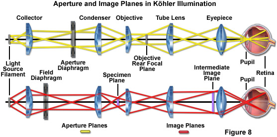

During the project, different type of low-cost light sources were used for different purposes: [LASER]() and [LED]().

### Coherence of The Light sources

#### LASER

Pen-lasers were used in the beggining for the alignment , blue UV and green VIS lasers. Green laser was so powerful. I tried to reduce the power using ND filter but instead of that I changed the laser.

In the alignment part of the Thorlabs setup, [RGB Laser source]() was used with red paper filter.

* More details and connection information of the RGB Lasers can be found [here.](.../Electronics/LED)

#### LED

After alignment of the mirrors in the setup,laser illumination part was changed with [red LED light source]() + [long-pass filter]() + Köhler illumination module.

Spectrum of the red LED:

* More details and connection information of the LED can be found [here.](.../Electronics/LED)

## Köhler Illumination

In the setup, we use red LED light source. It's a cheap component and illuminated light is incoherent. Adding additional Dichroic Longpass filter and Köhler Illumination part, we obtain almost collimated and higher coherence length light source.

*Köhler Illumination Diagram*

[REF](http://zeiss-campus.magnet.fsu.edu/articles/lightsources/lightsourcefundamentals.html)

* Pinhole is made by Aluminium foil with a dot (with needle).
* Aperture is adjustable 3D-printed module.
* In Thorlabs System
    Collector Lens (LENS 1) : [Thorlabs]()
    Field Lens (LENS 2) : [Thorlabs]()
    Condenser Lens (LENS 3) : [Thorlabs]()
* In UC2 System
    Collector Lens (LENS 1) :
    Field Lens (LENS 2) :
    Condenser Lens (LENS 3) :

## Dichroic Longpass filter

Spectrum of the red LED with dichroic long pass filter:

