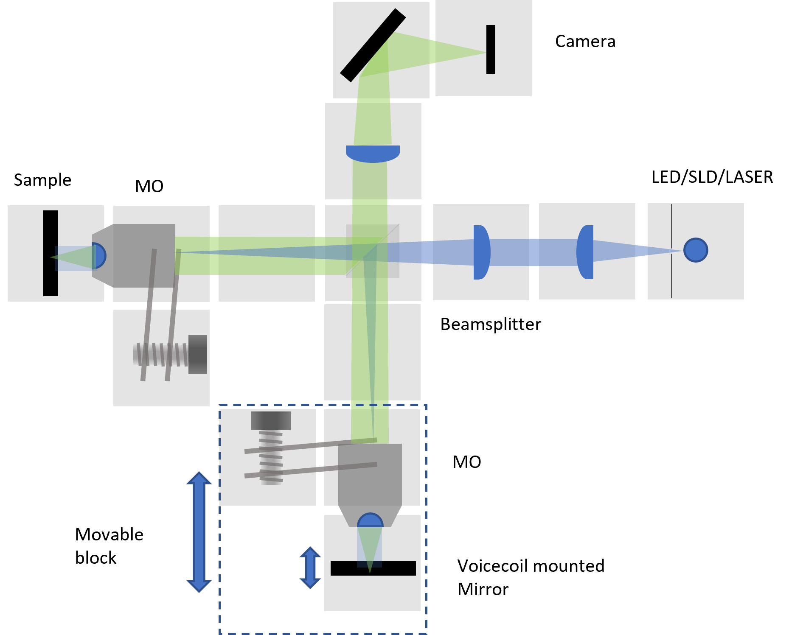

# OCT with openUC2 *Time-Domain, Low-Cost, 3D-Printed Optical Coherence Tomography*
---

This repository will help you to build and setup *UC2-OCT*.

*In this project, we will design a low-cost, 3D-printed, time-domain Optical Coherence Tomography based on UC2 system.*
We started to build our setup with basic version; Michelson Interferometer. Then, the setup will be adapted to the UC2 System with 3D-Printed inserts, Injection Molding (IM) cubes and cheap components.

***Features of the Project:***
* Low-cost : total cost of the 3D-printed system will be under 1500 €.
* Easy to assemble
* Open-Source
* 3D-Printed

***Key Parameters of the Project:***
*  cheap Light Source (red High Power LED)
*  cheap optical filters (Comar Longpass Filter etc.)
*  cheap Detector (RasPi camera and Raspi 4, Vision Camera)
*  cheap electronics (ESP-32S as microcontroller)
*  low-cost, light Gold-coated Mirror (DIY)

*UC2-OCT Setup Diagram (draw.io)*

*UC2-OCT Setup Diagram (Autodesk Inventor Rendered Image)*

The overall price is in the range *OF LESS THAT A ZILLION*.

## Table of Content
  * **[1. Theory](./1.Theory)**
  * **[2. Experimental Process](./2.Experimental Process)**
    * **[1. Modules](./2.Experimental Process/1.Modules)**
    * **[2. Alignment Procedure](./2.Experimental Process/2.Alignment Procedure)**
  * **[3. Results](./3.Results)**
    * **[Image Reconstruction](./3.Results/Image Reconstruction)**
  * **[4. Bill of Materials](./4.Bill_of_Materials)**

##         Project Timeline:

| Date | To Do | Status of the Task |
| --- | --- | --- |
| **September 2021** | Using Thorlab equipments, Michelson Interferometer was built with a RGB Laser and Red paper filter. | `DONE` |
| **October 2021** | Using Thorlab equipments, Michelson Interferometer is building with a red LED light source and dichroic longpass filter | `CANCELLED` |
| ** 5 November 2021** | Reference mirror with Voice coil actuators will be adapted to the 3D-printed system.  | `DONE by Benedict but NOT USED FOR NOW` |
| **12 November 2021** | Cheap SLD light source was found from EXALOS and ordered. It will arrive in December. Extra driver module should be ordered.  | `DONE` |
| **24-26 November 2021** | Working Thorlabs system (with laser) was adapted to the UC2 version as basic version of Michelson Interferometer. 3D-printed parts will be redesigned or adapted to the project. | `DONE` |
| **22-25 November 2021** | Voice Coil Actuator was inserted setup for moving the sample mirror in linear direction in UC2 setup. | `DONE` |
| **26-30 November 2021** | Voice Coil Actuator is testing. The setup size of the actuator is defining using the RasPi camera photos. | `IN PROGRESS` |
| **December 2021** | Driver module for SLD light source will be ordered.  | `WAITING` |
| **December 2021** | LED light source will be used in the UC2-OCT setup. Adapting the light source to the Michelson Interferometer.  | `WAITING` |
| **December 2021** | The components for TD-FF-OCT setup with UC2 designs will be built with LED light source.  | `WAITING` |
| **December 2021** | SLD light source will be adapted to the UC2-OCT.  | `WAITING` |

### 1st SETUP: Michelson Interferometer Experiment Setup with Thorlabs Equipment

**Setup with RGB Laser as a Light Source and the filter:**

Basic parameters of the setup:
*

**Setup with Red LED as a Light Source and the filter:**

Basic parameters of the setup:
*

### 2nd SETUP: Michelson Experiment Setup with UC2 IM unit blocks
**Setup with a Green Pen Laser as a Light Source and VCA:**

Basic parameters of the setup:
*

### 3rd SETUP: Time-Domain(TD) Full-Field(FF) Experiment Setup with UC2 unit blocks
**Setup with a Green Pen Laser as a Light Source, VCA, and other optical components:**

Basic parameters of the setup:
*

**Setup with Red LED as a Light Source (with filter), VCA, and other optical components (objectives, lenses, compensating plate):**

Basic parameters of the setup:
*

## Get Involved
This project is open so that anyone can get involved. You don't even have to learn CAD designing or programming.
You can directly connect with us using GitHub repository. Ask your questions or share your ideas with us!
