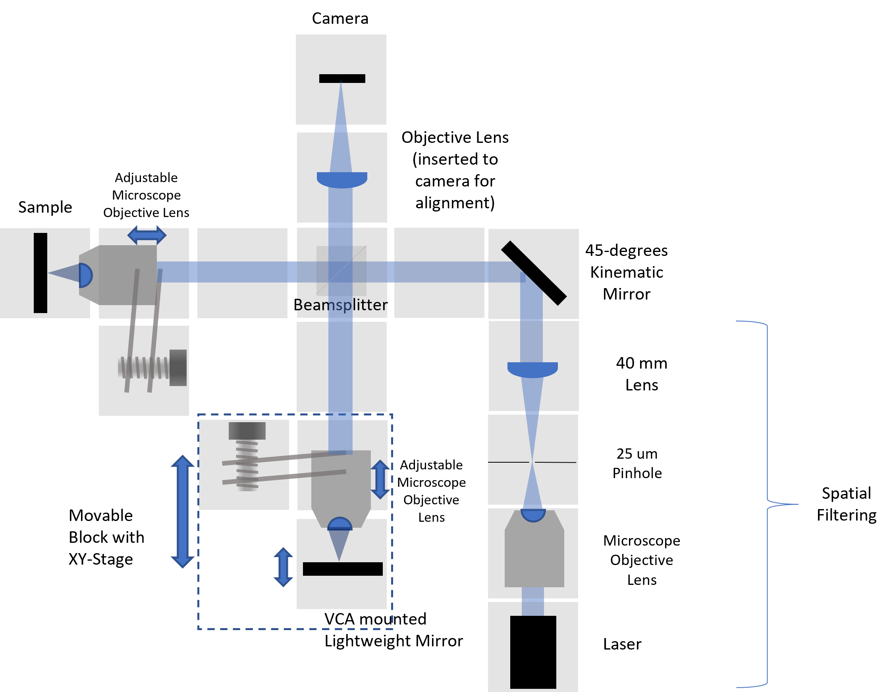
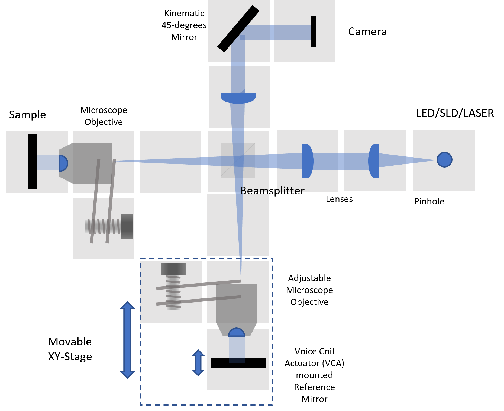

# *Open-Source, Low-Cost, 3D-Printed, Time-Domain Optical Coherence Tomography using UC2 Modular System*
---

This repository will help you to build and setup *UC2-OCT*.

In this project, we will design a open-source, low-cost, 3D-printed, Time-Domain Optical Coherence Tomography based on UC2 optical system.
The setup uses 3D-Printed inserts and cubes, Injection Molding (IM) cubes and cheap optical and electronic components. Some module designs were used directly from UC2-v3 designs, and some of them were redesigned for the UC2-OCT setup.

* The system is Low-cost : 3D-Printed inserts, IM cubes and cheap components
* Easy to assemble: 3D-printed cubic modular sytem
* Open-Source: UC2 based system and publishing all details online in GitHub repository
* 3D-Printed: UC2 based experimental setup

***Key Parameters of the Project:***
*  cheap Light Source (diode SLD; red High Power LED, red Laser)
*  cheap optical filters (Comar Longpass Filter etc.)
*  cheap Detector (Allied Vision Camera and ImSwitch Software)
*  cheap electronics (ESP-32S as microcontroller; VCA)
*  low-cost, light Gold-coated Mirror (DIY)

*UC2-OCT Setup Diagram (draw.io)*

__Sketch 1__ describes the OCT system with red laser. The aim of this step is aligning the Reference and Sample Mirror orientations and positions, location of the Objective Lenses with Adjustable Z-Stage system.
Basic idea of aligning with Laser is the setting up mirror and objective lens positions in Sample Arm and Reference arm.

__Sketch 2__ is built with different light source. SLD diode is a low-coherence light and adapting pre-aligned system.

*UC2-OCT Setup Diagram (with UC2 modules in Autodesk Inventor)*

## Table of Content
  * **[1. Theory](./1.Theory)**
  * **[2. Experimental Process](./2.Experimental Process)**
    * **[Modules](./2.Experimental Process/Modules)**
    * **[Alignment Procedure](./2.Experimental Process/Alignment Procedure)**
  * **[3. Results](./3.Results)**
    * **[Image Reconstruction](./3.Results/Image Reconstruction)**
  * **[4. Bill of Materials](./4.Bill_of_Materials)**

##         Project Timeline:

| Date | To Do | Status of the Task |
| --- | --- | --- |
| **October 2021** | Using Thorlab equipments, Michelson Interferometer was built with a RGB Laser and Red paper filter. | `DONE` |
| **November 2021** | Reference mirror with Voice coil actuators  adapted to the 3D-printed system.Cheap SLD light source was found from EXALOS and ordered. It will arrive in December. | `DONE` |
| **December 2021 - January 2022** | LED light source tried to be used in the UC2-OCT setup. Adapting the light source to the Michelson Interferometer. Aligning the setup is not easy with LED. Created a protocol with laser. | `DONE`|
| **1 April2022** | Official start of the Master Thesis Period.  | `DONE` |
| **April-May 2022** | Modules were updated to stable versions, made redesigning for some parts. Then setup was aligned and interference pattern for red RDG laser was observed. VCA moving is made with power supply. | `DONE` |
| *June 2022** | Alignment with laser, ImSwitch were adapted to the system to control VCA and saving images with Allied Vision camera in the same time. | `DONE` |
| *June 2022** | Alignment with laser will be complicated. Aim is obtaining the sample and reference mirrors and objectvie lens positions set. Having images of interferograms when VCA moves. And analysing the images. | `in progress` |
| *June 2022** | Adapting SLED to setup. Mounting and connection was made. Running SLED is next step. | `in progress` |

##### 1st SETUP: Michelson Interferometer Experiment Setup with Thorlabs Equipment - for practicing :)

##### 2nd SETUP: Michelson Experiment Setup with UC2 IM unit blocks
**Setup with a Laser as a Light Source and VCA:**

### 3rd SETUP: Time-Domain OCT with SLED
**Setup with SLED as a Light Source and VCA:**

### 4th SETUP: Time-Domain OCT with Red LED and Filter
**Setup with Red LED as a Light Source (with filter) and VCA:**

## Get Involved
This project is open so that anyone can get involved. You don't even have to learn CAD designing or programming.
You can directly connect with us using GitHub repository. Ask your questions or share your ideas with us!
