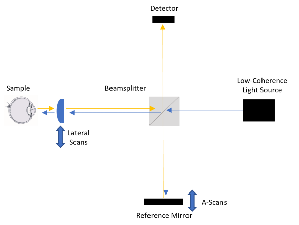
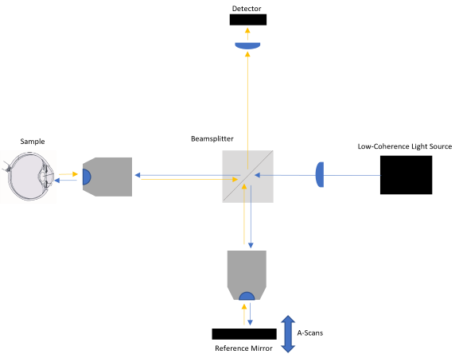
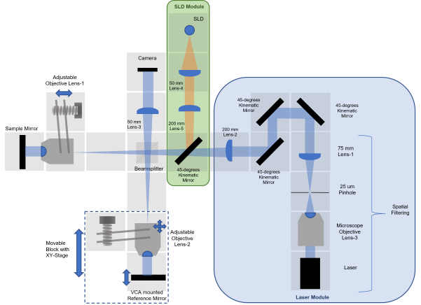
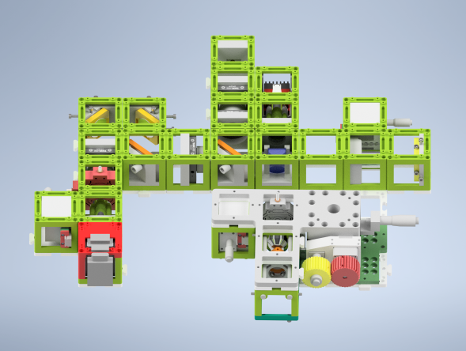

# Open-Source, Low-Cost, 3D-Printed, Full-Filled Time-Domain Optical Coherence Tomography using openUC2 Modular System
---
__*The project contents are still updating. Last update is in 17.10.2022.*__

This repository will help you to build and setup *UC2-OCT*.

In this project, we will design a open-source, low-cost, 3D-printed, Full-filled Time-domain Optical Coherence Tomography based on UC2 optical system.
The setup uses 3D-Printed inserts and cubes, Injection Molding (IM) cubes and cheap optical and electronic components. Some module designs were used directly from UC2-v3 designs, and some of them were redesigned for the UC2-OCT setup.

***Key Parameters of the UC2-OCT Project:***
* The system is Low-cost : 3D-Printed inserts, IM cubes and cheap components
  *  cheap Light Source (LaserLand RGB laser and Superlum SLD at 850 nm)
  *  cheap optical filters (Comar Longpass Filter)
  *  cheap Detector (RasPi camera and Raspi 4)
  *  cheap electronics (ESP-32S as microcontroller)
  *  low-cost, light Silver Mirror (DIY)
* Easy to assemble: 3D-printed cubic modular sytem
* Open-Source: UC2 based system and publishing all details online in GitHub repository
* 3D-Printed: UC2 based experimental setup

### THEORY

This section introduces the theoretical part of the *UC2-OCT* project. It will help you to understand the basic physics behind the setup. The setup is built using 3d-printed modular optical toolbox system openUC2. The details of the project is explained in its [GitHub](https://github.com/openUC2/UC2-GIT) repository in detail.

The basic parameteres of 3d-printed and IM base cubes are explained [here](https://github.com/openUC2/UC2-GIT/tree/master/CAD/ASSEMBLY_CUBE_Base). OCT is based on Michelson Interferometer system and it was already adapted and tested in [UC2](https://github.com/openUC2/UC2-GIT/tree/master/APPLICATIONS/APP_Michelson_Interferometer) design system.

##### Optical Coherence Tomography (OCT)

The following sketch demonstrates the basic OCT scheme based on time.

##### Full-filled Optical Coherence Tomography (FF-OCT)
*Working Principle:* FF-OCT employs a 2-D image sensor like a CCD or CMOS camera as the detector, and en-face images of the sample are acquired at different depths by coherence gating.

* High axial and lateral resolutions are possible with FF-OCT.
* The use of FF-OCT in the time-domain configuration avoids specialized and potentially expensive components such as galvanometer or MEMS micromirror scanners, swept-sources and even superluminescent diode (SLED) or halogen or supercontinuum sources. Simple LEDs provide sufficient illumination for sub-10-μm imaging. Such a system has the potential to create high resolution 3D tomograms at very low cost.

REFERENCE:
Invented by Claude Boccara in 1998 (France).
Resolution: 1um in 3D

The full-filled OCT (FF-OCT) setup give an opportunity of recording en-face images of the sample when the Reference mirror moves in the z-axis. The movement mechanism of the sample Objective lens is not needed in time-domain designs and the technique enables the high-speed OCT scanning with its this advantage. The working mechanism of the FF-OCT can be shown in the figure below.

### UC2-OCT

*UC2-OCT Setup Diagram*

__Sketch 1__ describes the OCT system with red laser and SLD light sources.   The experimental procedure starts with the laser source and then switches to SLD source. Basic idea of aligning with Laser is the setting up the mirrors and objective lenses positions in Sample Arm and Reference arm using the advantage of the long coherence length of the laser source.
SLD diode is a low-coherence light. The aligned setup is directly used with NIR-SLD light source. The details of the setup design and experimental steps are explained in the [Experimental Process section](./1.Experimental_Process).

*UC2-OCT Setup Diagram (adapted to Autodesk Inventor with UC2 modules)*

## Table of Content
  * **[1. Experimental Process](./1.Experimental_Process)**
    * **[Modules](./2.Experimental_Process/Modules)**
    * **[Alignment Procedure](./1.Experimental_Process/Alignment_Procedure)**
    + **[4. Bill of Materials](./1.Experimental_Process/Bill_of_Materials)**
  * **[2. Results](./2.Results)**

## Get Involved
This project is open so that anyone can get involved. You don't even have to learn CAD designing or programming.
You can directly connect with us using GitHub repository. Ask your questions or share your ideas with us!
